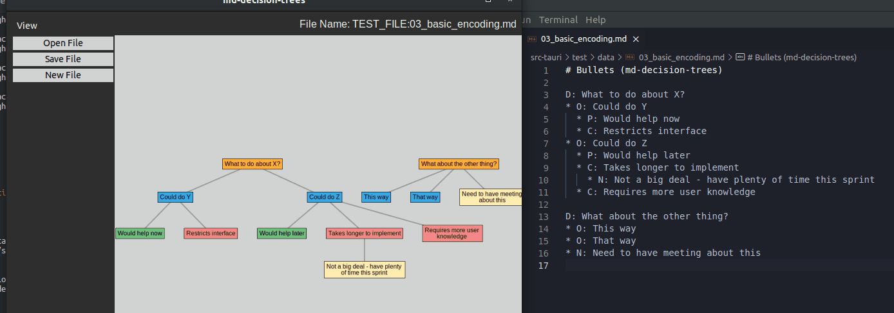

# md-decision-trees
## Demo
Here is a demo visualizing a file, navigating, creating a new Con, saving the file, deleting a con & its note, then saving again:



## Warning
Mainly a C++ developer :sweat_smile:

## The Problem
When making decisions, writing structured thoughts down is a go-to approach to avoid thinking in circles.  
With each decision comes multiple options - each with their owns pros, cons - easy enough to map out:  
Example:  
```md
What to do about X?
1. Option 1
  * Pros:
    * Very flexible
  * Cons:
    * So much dev. time
2. Option 2
  * Pros:
    * Can do it in ~3hrs
```
As this evolves, it start to get messy...:
* Options with their pros & cons bring in new decisions that need made - each with their options / pros / cons
* Notes get added that aren't exactly pros / cons, but shouldn't be forgotten about
* Duplicating info (from above, `Option 1` takes `so much dev. time` while `Option 2` takes `3hrs` - share dev time)

Could consider other approaches for mapping decisions out, but they have their own issues:
* Classic pen & paper - but harder to share with the team
* Shareable diagram - but could be time consuming to find the best way to visualize each decision tree
* Decision matrix - but are hard to fit notes into, plus tables are terrible to work with in markdown
* Definitely other approaches - but then I wouldn't have a side project `:)`

### Proposed Solution
The goals of this project are to:
* Provide a plain text (markdown) solution to map out complex decisions
* Provide a visualizer / graphical dimension to navigate aforementioned plain text files
* Prevent thinking in circles / tracking formatting while mapping out decisions
* Give myself a chance to work with Rust & a user interface

## Encoding Terms / Abbreviations / Color Codes
To create the decision hierarchy, we'll use an encoding strategy for organization (`<Token>: ...` or `* <Token>: ...`).  
In the UI, each type will have its own color coding for clarity:
* `D`: Decision (orange)
* `O`: Option (blue)
* `P`: Pro (green)
* `C`: Con (red)
* `N`: Note (yellow)

### Mapping Rules
Decisions can have 1 to many Options - labeled `O1` / `O2` / etc  
Options can have none or many Pros / Cons / child Decisions  
Pros / Cons can also associate with one to many Options (not implemented): 
* The association can be opposite - ex. a Pro for `O1` is a con for `O2`
* This will likely be tracked with tokens like `P1O1C1O2`  

Notes can be associated with one to many of any entity  

Errors will pop up if a creation is invalid!

## How To Use

### Packages to install

Install `pnpm`
* Likely using `npm` first - follow [this](https://pnpm.io/installation)

Run `pnpm install tauri`:
* If package installation fails, it is likely missing packages required for Tauri (see [Prerequisites](https://v1.tauri.app/v1/guides/getting-started/prerequisites))

### Running

`pnpm tauri dev` to start the app

### Bundle / Install the App For Linux

To install for linux:
* `pnpm tauri build`
* `sudo apt-get install src-tauri/target/release/bundle/deb/md-decision-trees_0.0.0_amd64.deb`

### Mouse 
Click and drag - move the canvas around
Scroll - change the zoom level

### Keyboard Use / Shortcuts
`h j k l` - Vim movement to walk through the tree:
* h / l - left and right siblings & j / k - parents & children

`esc` - Various exits - ex. to close the "Error Console" if it appears, clear selection, etc
`ctrl+m <node type, like d o p c n>` - Make nodes of a certain type:
* ex. `ctrl+m d` to create a Decision, `ctrl+m o` for an Option

`ctrl+e` - Edit the selected node's text **then** press `ctrl+e` again to save the edit:
* Can press `esc` or click elsewhere to cancel the text changes

`ctrl+d` - Delete selected node & its children
`ctrl+z` - Zoom to fit the as much tree as possible
`ctrl+s` - Save the current file

## Folder Layout / Links
`doc`
* [ADRs](./doc/ADRs/README.md)
* [Development Notes / Planning](./doc/development.md)
* [Working Notes](./doc/working_notes.md)  

[`patches`](./patches/README.md)  

`src-tauri` - Rust "back end" for parsing / writing files  
* `icons` - used for bundled program (not the UI)

`ui` - React "front end" for visualizing / interacting with decision tree nodes  
